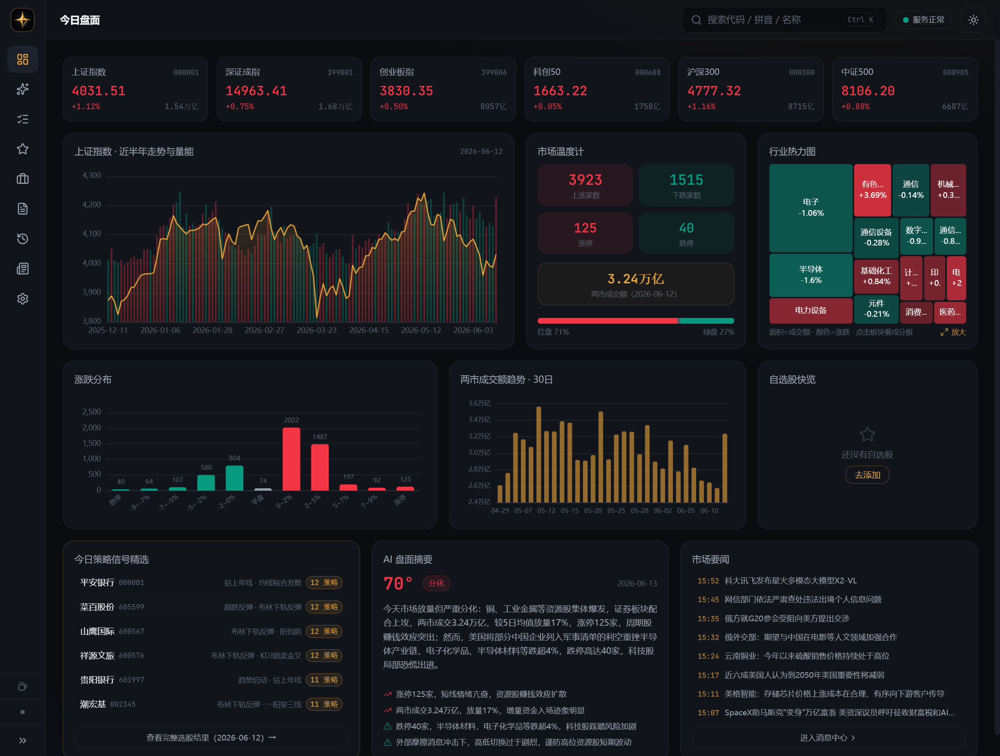
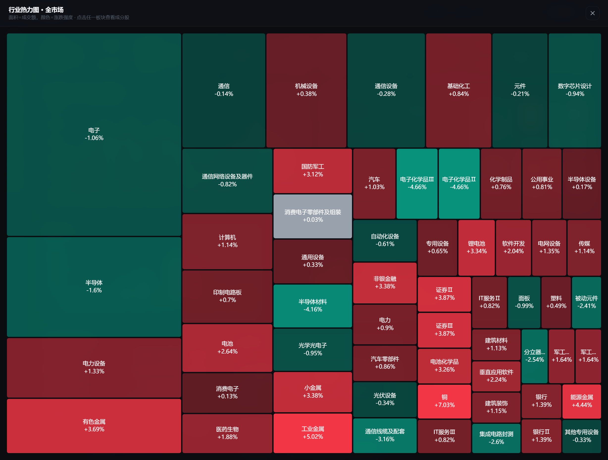
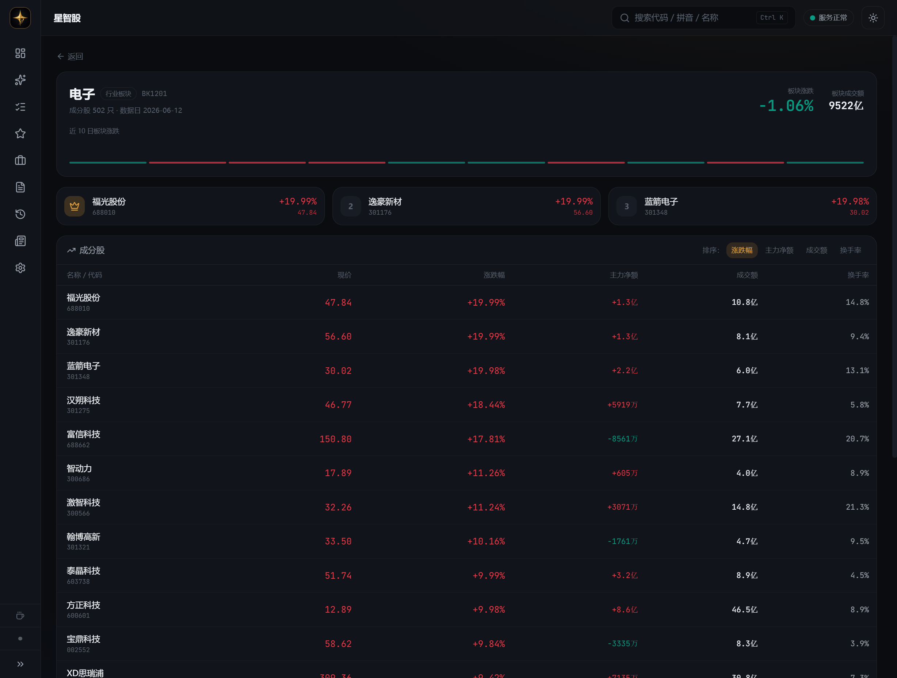
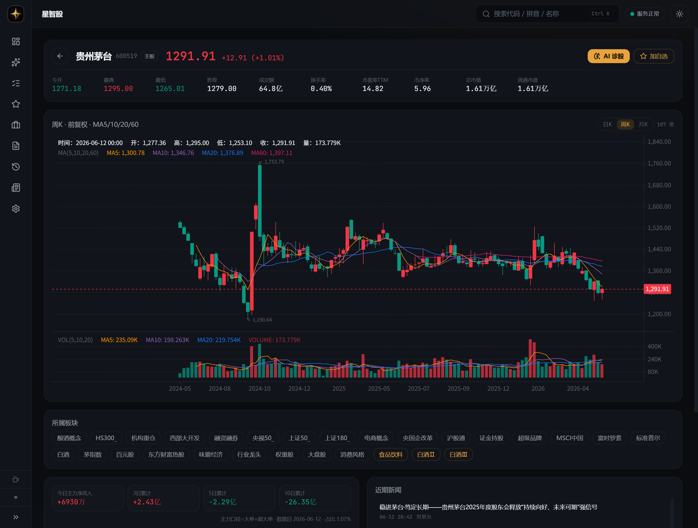
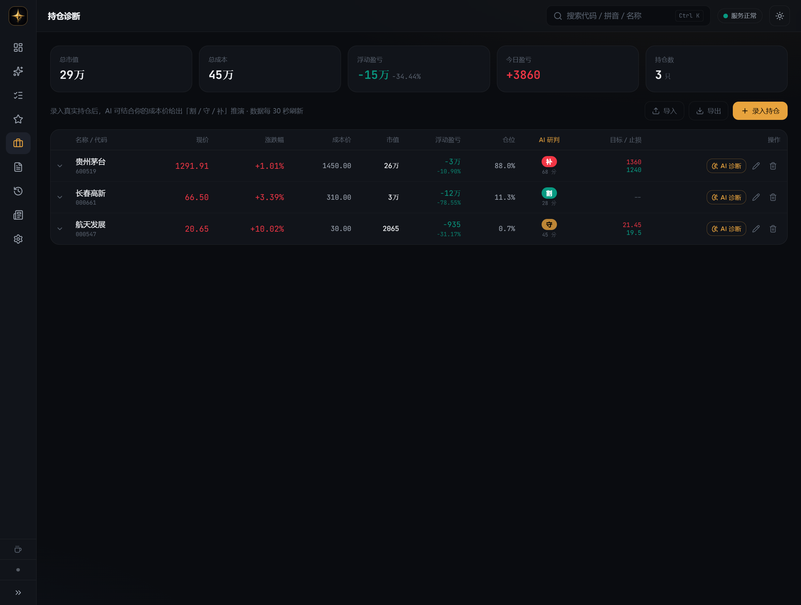
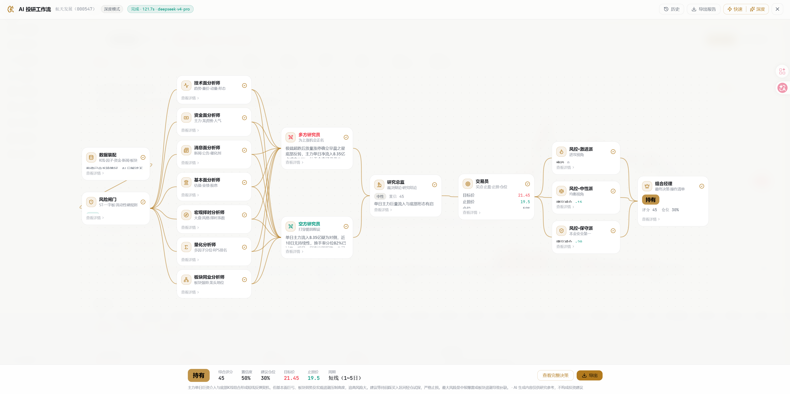
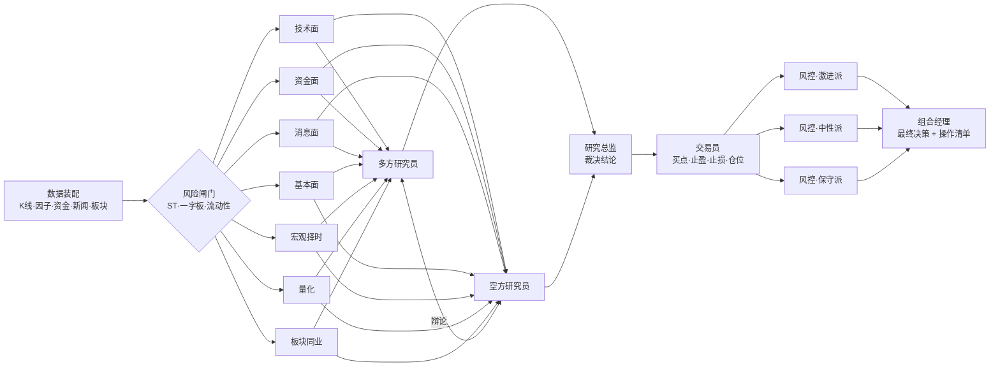
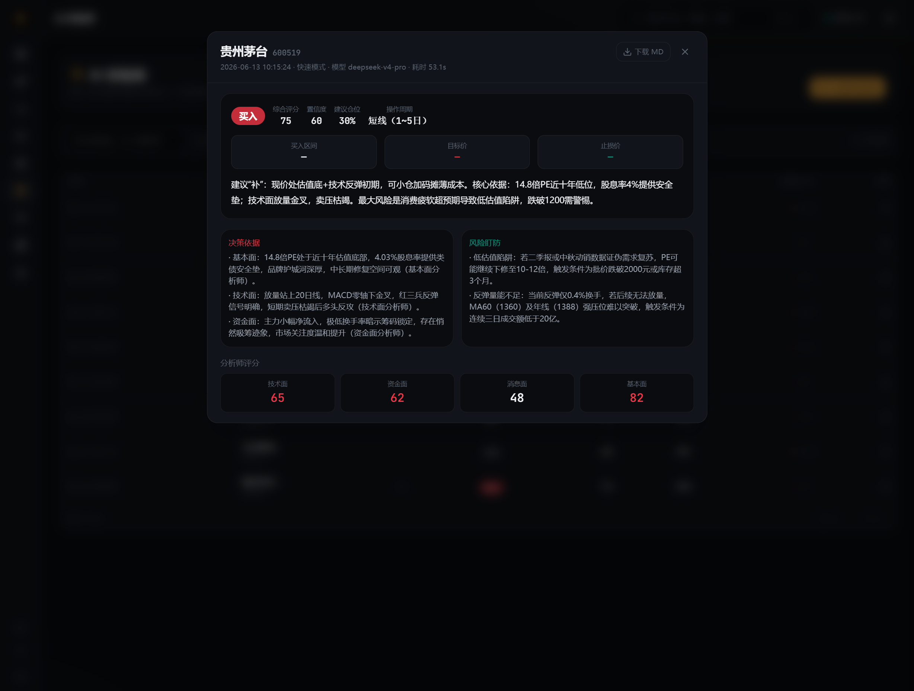
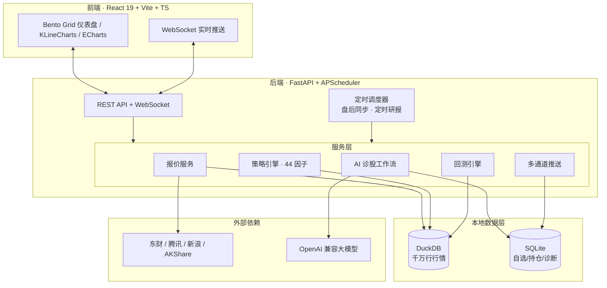

<div align="center">


# 星智股 · StockNova

**AI 驱动的 A 股智能投研终端 —— 行情 · 策略 · 回测 · 多角色 AI 诊股，一站式本地工作台**

[](LICENSE)
[](https://www.python.org/)
[](https://react.dev/)
[](https://fastapi.tiangolo.com/)
[](https://github.com/97Gz/StockNova/releases)

[功能亮点](#-功能亮点) · [AI 投研工作流](#-ai-投研工作流核心) · [快速开始](#-快速开始) · [系统架构](#-系统架构) · [路线图](#-路线图) · [赞助作者](#-赞助作者)

<br/>

[](https://github.com/97Gz/StockNova/releases/latest)

**普通用户无需配置任何环境** —— 下载解压、双击即用（绿色版，含系统托盘）

</div>

---

## 这是什么

这两年 A 股的走势越来越难琢磨 —— 风格切换快、题材轮动乱、消息满天飞，盯一整天盘也未必理得清一只票到底该走还是该守。**星智股（StockNova）** 想做的，是一个帮你「把信息收拢、把逻辑理顺、把决策落地」的本地投研助手。

它是一款完全开源、**本地运行、数据自持** 的 A 股个人投研工作台。把散户每天要做的事 —— 看盘、选股、复盘、盯持仓、读消息 —— 收进一个统一界面，并在关键环节接入大模型，用 **「一支多角色 AI 投研团队」** 替你把一只股票从技术、资金、消息、基本面、宏观、量化、板块七个维度并行拆解，再经过多空辩论、交易员定方案、风控委员会三方会签，最终由组合经理给出 **可执行** 的评级 / 仓位 / 买点 / 止盈 / 止损。

> 与「荐股软件」的根本区别：本项目 **不卖信号、不连账户、不碰你的钱**。所有数值由本地引擎算好，AI 只负责「解读」而不负责「算术」，全部输出都是研究推演，落地与否由你决定。

### 为什么不是「又一个看盘软件」

- 🧠 **一支 17 角色的 AI 投研团队**：点一下，技术 / 资金 / 消息 / 基本面 / 宏观 / 量化 / 板块**七维并行分析** → 多空辩论 → 风控三方会签 → 组合经理给出**可执行操作清单**，而不是一句空泛的「看多」。
- ⏳ **回溯诊断，验证 AI 准不准**：选定历史某一天，让 AI 以「那天为今天」做诊断（数据严格截断、杜绝未来函数），再用 **+5/10/20/60 日真实走势** 自动校验它当时给的目标价 / 止损价 —— 先看准了再信。
- 📰 **7×24 实时财经快讯**：盘中滚动的电报级快讯流，覆盖全球宏观与隔夜外盘，重点快讯还会喂给 AI 做盘面解读，不再错过盘前盘后的关键消息。
- 🔢 **算术归代码，解读归 AI**：指标、资金分位、波动率、择时系数全部本地 Python 算死，AI 只读不算 —— 从根上杜绝大模型「一本正经算错数」。
- 💼 **持仓全局视角**：填入账户总资金后，AI 不只看单票，还会结合**仓位集中度、现金占比**给出加 / 减 / 守的取舍建议。
- 🔒 **100% 本地、数据自持**：行情落本地 DuckDB（千万行级日线），业务数据落 SQLite，**不连账户、不传云端**。
- 🆓 **彻底免费开源**：无会员 / 广告 / 付费墙；开箱即用（设置页可视化配置），自带 Docker 与 Windows 桌面端。

<div align="center">



</div>

---

## ✨ 功能亮点

| 模块 | 能力 |
|---|---|
| 📊 **今日盘面** | 六大指数实时报价、上证走势量能、市场温度计、**全市场行业热力图（可全屏）**、涨跌分布、成交额趋势、AI 盘面摘要、市场要闻 |
| 🧠 **AI 投研工作流** | **16 节点多角色协同**（7 分析师 + 多空辩论 + 研究总监 + 交易员 + 三档风控 + 组合经理），快速 / 深度双模式，N8N 风格可视化画布 |
| ⏳ **回溯诊断 + 回测校验** | 指定历史某日做 AI 诊断（数据截断防未来函数），自动用 **+5/10/20/60 日真实走势** 校验目标价 / 止损价是否兑现，量化 AI 准确度 |
| 🎯 **策略广场** | 44 因子库 + 24 个白话策略 + 共振扫描 + 自然语言条件构建器 + 每日盘后自动跑批 |
| 📈 **策略历史推演** | 策略时光机：定期调仓资金曲线 vs 沪深300，真实交易约束（次日开盘成交 / 一字板跳过 / 跌停顺延 / 整百股 / 双边费率） |
| 💼 **持仓诊断** | 录入真实成本后，AI 给出「割 / 守 / 补」决策；**填入账户总资金即可分析仓位集中度 / 现金占比**；列表内联 **AI 研判 / 评分 / 目标价 / 止损价**；支持 CSV 导入导出 |
| ⭐ **自选股** | 盘中每 5 秒自动刷新，内联 AI 研判列，一键导出 |
| 📚 **AI 研报库** | 所有诊股记录（个股 / 持仓 / 定时研报 / 回溯诊断）自动归档，可筛选、可回看、可导出 Markdown |
| 🏭 **板块详情** | 板块概览 + 近 10 日走势 + 成分股排行（主力净额 / 成交额 / 换手率排序，龙头标记） |
| 📰 **7×24 消息中心** | 电报级实时财经快讯流，盘中滚动更新，覆盖**全球宏观与隔夜外盘**；个股新闻时间线；重点快讯自动入 AI 盘面摘要 |
| 🔔 **定时研报 + 推送** | 盘后自动批量诊断自选 + 持仓，推送到 **企业微信 / 飞书 / Telegram / 邮箱** |

<table>
  <tr>
    <td width="50%"><div align="center"><b>全市场行业热力图（全屏）</b></div></td>
    <td width="50%"><div align="center"><b>板块详情 · 成分股排行</b></div></td>
  </tr>
  <tr>
    <td width="50%"><div align="center"><b>个股 · 日/周/月 K 线切换</b></div></td>
    <td width="50%"><div align="center"><b>持仓诊断 · 内联 AI 字段</b></div></td>
  </tr>
</table>

---

## 🧠 AI 投研工作流（核心）

这是星智股区别于普通看盘软件的灵魂。一次「深度诊股」会驱动 **16 个节点、17 个 AI 角色** 协同工作，模拟一家投研机构的完整决策链路：

<div align="center">



</div>



**设计要点：**

1. **算术与解读分离** —— K 线指标、资金分位、波动率、择时系数等全部由 Python 算好，AI 只做语义解读，杜绝大模型「算错数」。
2. **风险闸门前置** —— ST / 退市 / 一字板 / 流动性不足等硬规则在 AI 介入前先用代码拦一道。
3. **多空对抗** —— 多方研究员负责「为上涨正名」，空方研究员负责「打穿脆弱假设」，研究总监裁决，避免单边乐观。
4. **量化基因** —— 内置多因子分位、RPS 排名、凯利仓位估算，契合 A 股「量化为王」的现实。
5. **可执行落地** —— 交易员给出具体买入区间 / 目标价 / 止损价，组合经理输出「操作清单」，而非一句空泛的「看多」。
6. **快速 / 深度双模式** —— 快速模式（核心 4 分析师，秒级出结论，省 token）；深度模式（全 16 节点，约 1～3 分钟，完整投研报告）。

<div align="center">



</div>

> **理论可信度溯源**：工作流中的分析视角、策略卡片与诊断报告附录，均标注其方法论出处与年代（详见 [理论与方法论溯源](#-理论与方法论溯源)），让每条结论「有据可查」。

---

## 🚀 快速开始

星智股提供三种运行方式，普通用户直接用方式一即可。

### 方式一：Windows 桌面端（推荐普通用户，开箱即用）

前往 [Releases](https://github.com/97Gz/StockNova/releases/latest) 下载 `StockNova-v0.1.0-win64.zip`，解压后双击 `StockNova.exe` 即可运行（绿色版，含系统托盘，无需 Python / Node 环境）。

> 自行打包：`./desktop/build.ps1`（需先装 `uv sync --group desktop`）。

### 方式二：开发模式（推荐开发者）

**前置要求**：[Python 3.12](https://www.python.org/) + [uv](https://docs.astral.sh/uv/) + [Node.js 20+](https://nodejs.org/) + [pnpm](https://pnpm.io/)

```powershell
# 克隆仓库
git clone https://github.com/97Gz/StockNova.git
cd StockNova

# 启动后端（终端 1）
cd backend
uv sync
uv run uvicorn app.main:app --reload   # → http://127.0.0.1:8000

# 启动前端（终端 2）
cd frontend
pnpm install
pnpm dev                                 # → http://127.0.0.1:5173
```

### 方式三：Docker（推荐自部署 / 服务器常驻）

```bash
git clone https://github.com/97Gz/StockNova.git
cd StockNova
docker compose up -d        # 构建并后台启动
# 浏览器打开 http://localhost:8000
```

数据持久化在命名卷 `stocknova-data`，升级 / 重启不丢；前后端同源、单端口 8000。

### 首次使用

打开 **设置中心 → 数据管理 → 初始化历史数据**（全市场约 10 年日线，约 1～2 小时，支持暂停 / 断点续传），再到 **AI 接入** 填入任意 OpenAI 兼容的 API Key（默认 DeepSeek）即可。

---

## 🏗️ 系统架构



**双库分工**：DuckDB 列存库存放全市场日线 / 快照（千万行级，选股回测的全市场扫描在此完成）；SQLite 存放自选股 / 持仓 / 策略配置 / 诊断报告等业务记录。两者皆为嵌入式文件数据库，无需安装任何数据库服务。

### 技术栈

| 层 | 选型 |
|---|---|
| **后端** | Python 3.12 · uv · FastAPI · APScheduler · SQLAlchemy · DuckDB · Pandas |
| **前端** | React 19 · Vite · TypeScript · Tailwind v4 · shadcn/ui · TanStack Query · KLineCharts · ECharts · Framer Motion · Zustand |
| **数据源** | 东方财富（历史 K 线 / 板块 / 快照 / 资金流 / 龙虎榜）· 腾讯（批量行情，主）· 新浪（行情，备）· AKShare（交易日历） |
| **AI** | OpenAI 兼容协议（默认 DeepSeek，可切 Qwen / GLM / Kimi / Ollama 本地模型） |
| **部署** | Docker（多阶段单容器）· PyWebView + PyInstaller（Windows 桌面端，托盘驻留） |

---

## 📰 数据来源说明

| 数据 | 来源 | 更新频率 |
|---|---|---|
| 历史日线 / 复权因子 | 东方财富 | 盘后增量（默认 15:35） |
| 盘中实时报价 | 腾讯（主）/ 新浪（备） | 自选股 5 秒 / 全市场 60 秒 |
| 板块 / 成分 / 热力图 | 东方财富 | 盘后 |
| 资金流 / 龙虎榜 / 业绩预告 / 人气榜 | 东方财富 | 盘后 15:45 |
| 5 分钟 K 线 | 东方财富 | 盘后 15:40 |
| 市场快讯 / 个股新闻 | 财联社电报等公开聚合 | 盘中滚动（约 60 秒） |
| 交易日历 | AKShare | 按需 |

> 所有数据均来自公开免费接口，仅供个人研究使用；请遵守各数据源的使用条款，勿用于商业分发。

---

## 📖 理论与方法论溯源

为提升可信度，系统在 **工作流提示词、策略卡片、诊断报告附录** 三处标注所用方法论的出处与年代，融合中外经典：

- **缠论**（缠中说禅，2006～2008 博客连载）—— 走势分型 / 中枢
- **量价理论**（威科夫 Richard Wyckoff, 1930s；以及 A 股语境下的「量在价先」）
- **趋势跟踪 / 均线系统**（葛兰碧八大法则，Joseph Granville, 1960）
- **多因子选股**（Fama-French 三因子, 1992；A 股本土化因子）
- **情绪周期 / 龙头战法**（A 股游资「打板」体系，近十年市场实践沉淀）
- **价值与安全边际**（格雷厄姆《聪明的投资者》, 1949）

> 注：理论标注用于说明分析「视角的来源」，不代表对任何个人或流派的背书；涉及争议人物的内容已主动剔除。

---

## 🗺️ 路线图

- [x] M2 行情中心（盘面 / K 线 / 自选 / 搜索）
- [x] M3 策略引擎（44 因子 + 24 策略 + 共振扫描 + 每日跑批）
- [x] M4 回测引擎（策略时光机，真实交易约束）
- [x] M5 消息情绪 + 扩展数据（资金流 / 龙虎榜 / 人气榜）
- [x] M6 多角色 AI 投研工作流（16 节点 · 快速/深度）
- [x] AI 研报库 + 定时研报 + 多通道推送
- [x] Docker + Windows 桌面端
- [x] 回溯诊断 + 回测校验：指定历史节点诊股，用后续真实走势验证可靠性
- [x] 账户总资金分析：结合仓位集中度 / 现金占比给加减仓建议
- [ ] 自定义因子编辑器 + 因子有效性检验
- [ ] 多模型路由（按角色分配不同 LLM）
- [ ] 组合层风险归因与相关性分析

---

## ❓ FAQ

<details>
<summary><b>会泄露我的账户 / 资金吗？</b></summary>

不会。本项目不接入任何券商账户、不读取持仓接口，持仓数据是你手动录入、仅存本地 SQLite。AI 调用只发送行情与指标文本，不含任何身份信息。
</details>

<details>
<summary><b>没有 API Key 能用吗？</b></summary>

行情、策略、回测、热力图等全部功能不依赖 AI，可正常使用；仅「AI 诊股 / 盘面摘要 / 情绪分析」需要配置任意一个 OpenAI 兼容的 Key。
</details>

<details>
<summary><b>初始化数据要多久？</b></summary>

全市场 10 年日线约 1～2 小时（取决于网络），支持暂停与断点续传，中断不怕。日常只需盘后增量同步（秒级～分钟级）。
</details>

<details>
<summary><b>AI 给的结论能直接照着买吗？</b></summary>

**不能。** 所有输出均为数据推演与多角度分析，不构成投资建议。请把它当作一个「不知疲倦的研究助理」，最终决策与风险自负。
</details>

---

## 🤝 参与贡献

欢迎 Issue 与 PR！

1. Fork 本仓库并新建分支：`git checkout -b feat/your-feature`
2. 提交遵循 [Conventional Commits](https://www.conventionalcommits.org/)（如 `feat: ...` / `fix: ...`）
3. 后端 `uv run ruff check`、前端 `pnpm build` 通过后再提 PR
4. 在 PR 描述里说明动机与验证方式

---

## 💛 赞助作者

星智股是我用业余时间打磨的开源项目，**免费且无任何付费功能**。如果它帮你省了时间、看清了行情，欢迎扫码请我喝杯咖啡 —— 这会让我更有动力把它做得更好。不打赏也完全没关系，点个 **⭐ Star** 同样是莫大的支持。

<div align="center">
<table>
  <tr>
    <td align="center"><br/><b>微信</b></td>
    <td align="center"><br/><b>支付宝</b></td>
  </tr>
</table>
</div>

### 📮 关注公众号

也欢迎扫码关注作者的微信公众号，第一时间获取 **新版本动态、使用技巧与 A 股复盘思路**，有问题也可以在这里交流反馈。

<div align="center">

</div>

---

## ⚠️ 免责声明

本项目为个人学习研究工具，所有输出（包括但不限于 AI 诊股、策略信号、回测结果）均为基于公开数据的推演与多角度分析，**不构成任何投资建议，亦不对任何投资决策的结果负责**。股市有风险，入市需谨慎。

## 📄 许可证

本项目基于 [MIT License](LICENSE) 开源，Copyright © 2026 GZzz。

---

<div align="center">

如果这个项目对你有帮助，点个 **⭐ Star** 支持一下吧！

</div>
